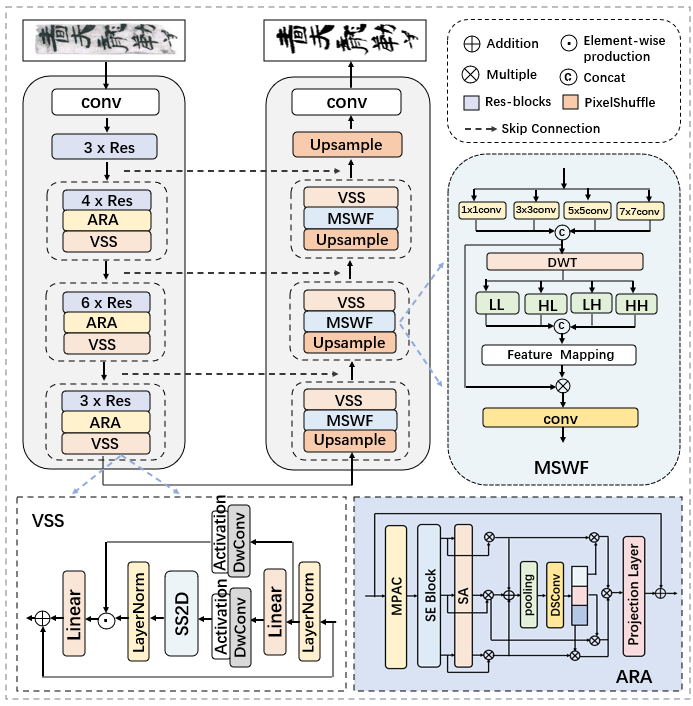
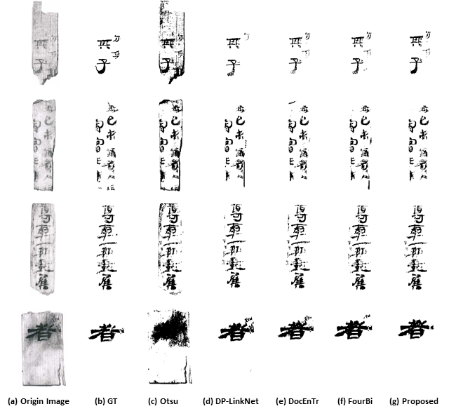

# Binarizing Severely Degraded Ancient Bamboo Slips: Dataset and Baseline

## Abstract
Bamboo and wooden slips were the primary  writing materials in China for more than 800 years, carrying valuable historical records. However, due to the lengthy corrosion and/or  weathering effects over a period of two millennia, texts on the ancient bamboo (and wooden) slips typically suffer from severe degradation problems, such as ink deterioration and text blur, which renders the binarization of  severely degraded bamboo slip manuscripts a very challenging task. Due to the scarcity of benchmark dataset in this direction, in this work we aim to build HanBamboo, a specialized bamboo slips dataset with pixel-level annotations for research on binarization of severely degraded ancient manuscripts. HanBamboo comprises 1,000 infrared bamboo slip images displaying varying levels of ink  degradation and text blur. Among them, bamboo slips exhibiting low-contrast ink traces characterized by significant fading and diminished visibility requires remarkably greater time in pixel-level annotation, indicating the inherent difficulty in binarizing these bamboo slips. As a minor contribution, we also propose a baseline approach MRA-Net, which is an Mamba-based Encoder-Decoder framework for degraded bamboo slips binarization that devises additional multi-scale wavelet processing and adaptive re-weighted attention fusion mechanisms to capture and enhance the stroke details of the texts and suppress background noise during binarization. Comprehensive experiments on both HanBamboo and public document binarization benchmark datasets DIBCO 2017 and 2018 demonstrate the effectiveness of our baseline.


## Our Framework
<p align="center">
  
</p>

## Using the code:
The code is stable while using Python 3.8, PyTorch 1.13.0, CUDA =11.7.

## Main environments:
```
conda create -n mranet python=3.8
conda activate mranet
pip install torch==1.13.0 torchvision==0.14.0 torchaudio==0.13.0 --extra-index-url https://download.pytorch.org/whl/cu117
pip install packaging
pip install pytest chardet yacs termcolor
pip install timm==0.4.12
pip install submitit tensorboardX
pip install triton==2.0.0
pip install causal_conv1d==1.0.0  # causal_conv1d-1.0.0+cu118torch1.13cxx11abiFALSE-cp38-cp38-linux_x86_64.whl
pip install mamba_ssm==1.0.1  # mmamba_ssm-1.0.1+cu118torch1.13cxx11abiFALSE-cp38-cp38-linux_x86_64.whl
pip install scikit-learn matplotlib thop h5py SimpleITK scikit-image medpy yacs
```

## Data Presentation and Model Parameters
- We provide 200 sample images from the constructed HanBamboo dataset, including the original images, the annotated ground truth images, and the binarization results produced by our model
, at the [link](https://drive.google.com/drive/folders/1xR2LapoqvvTGaECGuFBfOmhBU7McmMcN?usp=drive_link).
- Furthermore, we have provided the optimal model [parameters](https://drive.google.com/drive/folders/1-vBfPsdzo6wrwC0DyGDNFQfdXN6Ypdn1?usp=drive_link).

## DataFormat
Make sure to put the files as the following structure:
```
dataset_xuanquan/
├── image1.png
├── image2.png
├── image3.png
├── ……
├── GT/
│ ├── image1.png
│ ├── image2.png
│ ├── image3.png
│ ├── ……
├── train/
│ ├── 0_img.png
│ ├── 0_mask.png
│ ├── 1_img.png
│ ├── 1_mask.png
│ ├──……
```

## Training and Validation
### 1) Train the model.
The model is trained on patches,We provide the code to create the patches and train the model. 
```
python create_patches.py
python train.py 
```

### 2) Test.
```
python test.py 
```

## Comparison with other methods
| Method     | FM↑       | pFM↑      | PSNR↑     | DRD↓     |
| ---------- | --------- | --------- | --------- | -------- |
| Otsu       | 69.52     | 70.16     | 13.72     | 30.91    |
| Sauvola    | 68.77     | 69.63     | 13.65     | 24.96    |
| Gatos      | 73.12     | 73.60     | 14.49     | 16.79    |
| Suh        | 83.94     | 82.78     | 17.27     | 5.86     |
| DP-LinkNet | 83.96     | 83.89     | 17.84     | 4.81     |
| cGANs      | 83.14     | 83.26     | 17.53     | 5.04     |
| Zhao       | 81.84     | 81.52     | 17.25     | 6.48     |
| DocEnTr    | 83.30     | 83.55     | 16.43     | 6.11     |
| FourBi     | 84.13     | 84.48     | 17.81     | 4.62     |
| Ours       | **84.87** | **85.16** | **17.98** | **4.33** |

## Visual comparison
<p align="left">
  
</p>
